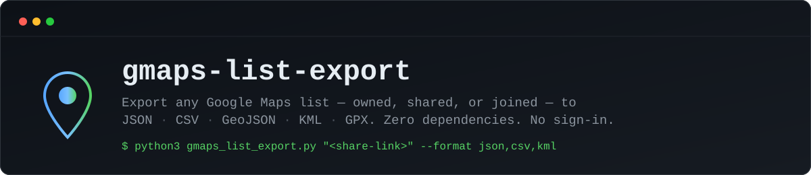

<p align="center">
  
</p>

<p align="center">
  <a href="LICENSE"></a>
  <a href="https://www.python.org/downloads/"></a>
  
  
</p>

# Export a Google Maps List to CSV, JSON, KML or GPX (Free, No Extension, No Sign-In)

A free, open-source Python script that exports any Google Maps list to CSV, JSON, GeoJSON, KML, or GPX. This works on shared lists you don't own, lists you only joined, not just your own. No Chrome extension, no account sign-in, no Google Takeout, no per-export limit.

Pointing an AI coding agent at this instead? See [AGENTS.md](AGENTS.md) in this repo for a version written for that.

## The problem this solves

Google Maps has no built-in export button for lists. Google Takeout only exports lists you personally created. A list someone shared with you, that you joined, is invisible to Takeout even though it shows up fine in Maps under Saved, Your lists.

Most tools that solve this are a paid Chrome extension with a free-tier cap, or a paid web app you have to hand your list's link to. This is neither. It's about 200 lines of standard-library Python you can read in a couple of minutes, run locally, and never touch again.

## Usage

```bash
python3 gmaps_list_export.py "https://maps.app.goo.gl/XXXXXXXX" --format json,csv,kml
```

Works with a short share link (`maps.app.goo.gl/...`) or the long form Maps gives you from the address bar.

<p align="center">
  
</p>

```
$ python3 gmaps_list_export.py "https://maps.app.goo.gl/XXXXXXXX" --format json,csv,kml

Resolving list...
  list id:  -mup0V4zyZUEpvJl_Tvf2UMziCBMGg
  token:    3PoDpW5u7uo
Fetching places...
  "COCO Fuel Station" - 382 places (0 missing coordinates)
  wrote places.json
  wrote places.csv
  wrote places.kml
```

## Available export formats

| Format | Use |
|---|---|
| `json` | Raw data, for scripting (default if `--format` is omitted) |
| `csv` | Spreadsheets, Google Sheets, Excel |
| `geojson` | GIS tools, map libraries (Leaflet, Mapbox, QGIS) |
| `kml` | Google Earth, Google My Maps import |
| `gpx` | GPS units, OsmAnd, Organic Maps, Garmin |

Plain XML isn't offered on its own. GPX is XML, and it's the standard form for point-of-interest data, so it already covers that ground.

## Output fields

Every place comes back with real coordinates, pulled directly from the same data Google Maps uses to render the list (a Takeout export can be missing coordinates for dropped pins; this doesn't have that gap):

- `name`: short display name, as shown on the pin label
- `label`: full name and address, concatenated
- `address`: address only
- `lat` / `lng`: coordinates
- `cid`: Google's internal CID pair for the place
- `placeId`: short-form place ID (`/g/...`), for looking the place up again later

## Why it works

A share link is just a redirect. Following it (with a plain, unremarkable user agent) lands on a URL carrying the list's real id and share token. That URL is exactly what the list's own page uses internally to ask for its contents: the same `entitylist/getlist` call the page fires on load to draw itself. The response is one large nested array. The place list sits four levels down (`data[0][8]`), with every entry's fields at fixed positions.

This calls an undocumented Google endpoint, not a public API. It could change without notice. As of writing it needs no authentication for a publicly shared list, and returns the whole list in one response: no clicking, no hovering, no per-pin requests. The request caps at 500 entries per call (the `4i500` parameter), untested past that.

## FAQ

**How do I export a Google Maps list I don't own?** Run this script against the share link. Ownership isn't checked, only whether the list is publicly link-shared.

**How do I get coordinates from a shared Google Maps list?** That's the `lat` / `lng` fields in every output format, extracted directly, no geocoding step needed.

**Why doesn't Google Takeout show my saved list?** Takeout only exports lists you created. A list you joined through someone else's link never appears there.

**Is this free?** Yes. MIT-licensed, no rate limit imposed by the script, no account, no place-count cap.

## Troubleshooting

**"Couldn't find a list id in the resolved URL"**: the link resolved to something that isn't a list (a single place, a plain map view). Open it in a browser and confirm the address bar shows something containing `/placelists/list/...`.

**Place count looks short, or coordinates are missing**: the request caps at 500 entries per call, untested past that size. A bare dropped pin with no linked business can come back with `lat` / `lng` present but a thin `label`. That's the source data, not a bug.

**`json.loads` or `urllib.error.HTTPError`**: usually means the list needs the viewer signed in and added as a collaborator. Try an incognito window to check whether it's genuinely public before assuming the script is broken.
